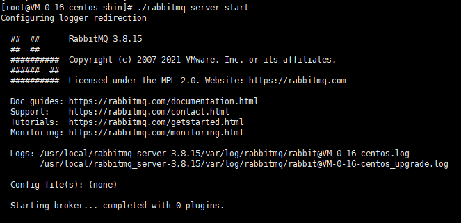

## MQ主要特点：
1、是一个独立运行的服务，生产者发送消息，消费者接收消费，需要先跟服务器建立连接。<br >
2、采用队列作为数据结构，有先进先出的特点。<br >
3、具有发布/订阅（publish/subscribe）的模型，消费者可以获取自己需要的消息。<br >
MQ 用来帮我们存储和转发消息。

## 为什么使用MQ：

#### 实现异步通信：
当一个异步过程调用发出后，调用者不会马上得到结果。而是在调用发出后，被调用着通过状态、通知来通知调用者，或者通过回调函数处理这个调用。
#### 实现系统解耦：
系统复杂，多个模块解耦，订单、库存、支付、通知。
#### 实现流量削峰：
MQ是Queue，有队列的特性，先进先出（FIFO）
#### 实现广播通信：
一对多通信，已订单系统退货为例，新增了结果通知系统，只需要增加队列监听即可，不需要生产者任何代码修改。

> 使用MQ会增加运维成本，系统的可用性降低，系统复杂性提高。根据实际情况来分析如何使用MQ。


## RabbitMQ架构

基于Erlang语言开发，Erlang是为电话交换机编写的语言，适合分布式和高并发。
RabbitMQ实现了AMQP协议（**重点了解AMQP协议**）

#### 1、Broker

默认端口5672，中介/经纪人

#### 2、Connection

生产着发送消息，还是消费者接收消息，都必须跟Broker之间建立一个连接，这个连接是TCP长连接。

#### 3、Channel

AMQP里引入了Channel的概念，是一个虚拟连接，可以理解成消息信道，这样就可以在保持的TCP长连接里面去创建和释放Channel，大大减少了资源消耗。不同的Channel是相互隔离的，每个Channel有自己的编号。

Channel是RabbitMQ原生API里面的最重要的编程接口，定义交换机、队列、绑定关系、发送消息、消费消息，调用的都是Channel接口的方法。

#### 4、Queue

队列是生产者和消费者的纽带，生产者发送消息到队列，在队列中存储，消费者从队列里消费消息。

RabbitMQ是用数据库来存储消息的，用Erlang开发，名字叫Mnesia。存储目录RabbitMQ/db/...

#### 5、Consumer

消费者消费消息有两种模式：Pull，Push

##### 5.1、Pull--主动拉取

对应方法是basicGet，消息存放在服务端，只有消费者主动获取才能拿到消息，如果每隔一段时间获取一次，消息的实时性就会降低。但是好处是可以根据自己的能力来决定消费消息的频率。

##### 5.2、Push--被动接收

对应方法是basicConsume，只要生产者发消息到服务器，就马上推送给消费者，消息保存在客户端，实时性较高，如果消费者消费不及时可能会造成消息积压。


> RabbitMQ中Pull和Push都有实现。Kafka和RocketMQ只有pull


一个消费者可以监听多个队列，一个队列也可以被多个消费者监听。

在生产环境中，建议一个消费者只处理一个队列消息。如果需要提升处理消息的能力，可以增加多个消费者，这时，消息就会在多个消费者之间轮询。

#### 6、Exchange

路由消息组件，将消息发送到Exchange，由它来分发消息，Exchange不会存储消息，只会根据规则分发消息。

Exchange需要和这些接收消息的队列建立绑定关系，并且为每个队列指定一个特殊标识。

Exchange和队列是多对多的绑定关系，一个交换机的消息有一个路由给多个队列，一个队列也可以接收来个多个交换机的消息。

绑定关系建立好之后，生产者发送消息到Exchange，也会携带一个特殊的标识。当这个标识跟绑定的标识匹配的时候，消息就会发给一个或多个符合规则的队列。

#### 7、Vhost

虚拟主机概念，提高硬件资源的利用率，实现资源的隔离和权限的控制。类似于namespace和package，不同的VHOST中可以有同名的Exchange和Queue。

为不同的业务创建不同的VHOST，然后在为他们创建专属用户，给用户分配对应的VHOST权限。

会有自带的默认VHOST，名字是“/”。


### 路由方式

http://tryrabbitmq.com/

#### 1、Direct直连

一个队列与直连类型的交换机绑定，需指定一个**明确的绑定键（binding key）**。

生产者发送消息时，会携带一个路由键（routing key）。当消息的路由键与某个队列的绑定键完全匹配时，这条消息才会从交换机路由到这个队列上。多个队列也可以也使用相同的绑定键。

```java
channel.basicPublish("DIRECT_EXCHANGE", "Spring", "Direct直连，明确绑定键。"); // binding key = Spring。会发送到Spring的Queue。
```

#### 2、Topic主题

一个队列与主题类型的交换机绑定时，可以在绑定键中使用通配符。支持两个通配符。

“#”：代表0个或者多个单词。

“*”：代表只能有一个单词。

单词指的是用英文的点“.”隔开的字符。例如a.bc.def是3个单词。

> 例如：
>
> 1、binding key = java.# 路由键以java开头的消息路由，后面可以有单词，也可以没有。
>
> 2、binding key = #.java 路由键以java结尾的消息路由，前面可以有单词，也可以没有单词。
>
> 3、binding key = xu.* 路由键以xu开头，并且后边只有一个单词的消息路由。
>
> 4、binding key = *.xu 路由键以xu结尾，并且前面只有一个单词的消息路由。

```java
channel.basicPublish("TOPIC_EXCHANGE", "java.xu.crazy", "Topic主题，1收到");
channel.basicPublish("TOPIC_EXCHANGE", "xu.java", "Topic主题，2、3收到。");
channel.basicPublish("TOPIC_EXCHANGE", "crazy.xu", "Topic主题，4收到。");
```

可以用于消息过滤场景，多个二级场景下，就可以使用不同的绑定键接收消息。

#### 3、Fanout广播

广播类型的交换机与队列绑定时，不需要指定绑定键。生产者发送消息到广播类型的交换机上，不需要携带路由键。消息到达交换机时，所有与之绑定了的队列，都会收到相同的消息副本。

```java
channel.basicPublish("FANOUT_EXCHANGE", "", "Fanout广播，都收到。");
```

可以用于通用的业务消息，广播一下，然后大家都收到了。如果有新增队列，自己建队列即可，不需要生产者进行操作。

#### 4、Headers

emmmmm....不常用。

### RabbitMQ安装

> * RabbitMQ依赖于Erlang，需要先安装Erlang。
>
> * Erlang和RabbitMQ版本有对应关系。https://www.rabbitmq.com/which-erlang.html


#### 1、安装Erlang 21.3

安装依赖

```
// 注意：因为每个人的操作系统环境是不一样的，缺少的依赖不同，根据提示安装。
yum -y install gcc glibc-devel make ncurses-devel openssl-devel xmlto perl wget
```

下载安装包

> ```
> wget http://erlang.org/download/otp_src_22.3.tar.gz
> tar -xvf otp_src_22.3.tar.gz
> cd otp_src_22.3
> ./configure --prefix=/usr/local/erlang
> ```

> configure的过程如果有err，要解决依赖的问题。
> 如果有APPLICATIONS INFORMATION，DOCUMENTATION INFORMATION，没有影响。

> ```
> make && make install
> 
> // 如果提示缺少socat
> yum install -y socat
> ```

#### 2、配置Erlang环境变量

> ```
> vim /etc/profile
> ```

加入一行

> ```
> export PATH=$PATH:/usr/local/erlang/bin // 安装地址
> ```

编译生效

> ``` 
> source /etc/profile
> ```


#### 3、验证Erlang是否安装成功

输入`erl`，会出现版本信息，即安装成功

```
[root@VM-0-16-centos sbin]# erl
Erlang/OTP 22 [erts-10.7] [source] [64-bit] [smp:2:2] [ds:2:2:10] [async-threads:1] [hipe]

Eshell V10.7  (abort with ^G)
1> 
退出命令：halt(). * exit命令是不管用滴
```

#### 4、安装RabbitMQ 3.8.15

> https://github.com/rabbitmq/rabbitmq-server/releases 下载安装包，版本自己选择。我这选择3.8.15
>
> ```
> # 解压
> xz -d rabbitmq-server-generic-unix-3.8.15.tar.xz
> tar -xvf rabbitmq-server-generic-unix-3.8.15.tar 
> ```

#### 5、配置RabbitMQ环境变量

> 自己指定下载目录，假设在/usr/local
>
> ```
> vim /etc/profile
> ```

添加一行

```
export PATH=$PATH:/usr/local/rabbitmq_server-3.8.15/sbin
```

编译生效

```
source /etc/profile
```

#### 6、启动RabbitMQ

```
# 后台启动rabbitmq服务
cd /usr/local/rabbitmq_server-3.8.15/sbin

./rabbitmq-server -detached
或者
./rabbitmq-server start
或者
service rabbitmq-server start
```

看到兔子头像就启动成功了



#### 7、添加用户

因为guest用户只能在本机访问，添加一个admin用户，密码是admin123

```
./rabbitmqctl add_user admin admin123
./rabbitmqctl set_user_tags admin administrator
./rabbitmqctl set_permissions -p / admin ".*" ".*" ".*"
```

#### 8、启用管理插件

```
./rabbitmq-plugins enable rabbitmq_management
```

#### 9、访问http://IP:15672

**大功告成喽~**


### RabbitMQ 延时投递

#### 1、Message TTL （Time To Live）

* 队列消息过期属性（x-message-ttl）,所有队列中的消息超过时间未被消费时，都会过期。

  * > ```java
    > @Bean("ttlQueue")
    > public Queue queue() {
    >     Map<String, Object> map = new HashMap<String, Object>();
    >     // 队列中的消息未被消费11秒后过期
    >     map.put("x-message-ttl", 11000);
    >     return new Queue("MESSAGE_TTL_QUEUE", true, false, false, map);
    > }
    > ```

* 消息过期属性，指定某个消息过期时间。

  * > ```java
    > MessageProperties messageProperties = new MessageProperties();
    > messageProperties.setExpiration("4000"); // 消息的过期属性，单位ms
    > messageProperties.setDeliveryMode(MessageDeliveryMode.PERSISTENT);
    > Message message = new Message("这条消息4秒后过期".getBytes(), messageProperties);
    > rabbitTemplate.send("MESSAGE_TTL_EXCHANGE", "expiration.ttl", message);
    > ```

如果同时指定了Message TTL 和 Queue TTl, 则小的那个时间生效。

有了过期时间还不够，这个消息不能直接丢弃，不然就没法消费了，丢到一个容器里面，实现延迟消费。**死信队列**

#### 2、死信

队列在创建的时候可以指定一个死信交换机DLX(Dead Letter Exchange)。死信交换机绑定的队列被称为死信队列DLQ(Dead Letter Queue)，DLX也是普通的交换机，DLQ也是普通的队列。

消息过期之后，队列指定了死信交换机DLX，就会发送到死信交换机DLX，如果死信交换机DLX绑定了死信队列DLQ，就会路由到死信队列DLQ，路由到死信队列DLQ之后，就可以进行消费。

**生产者-->原交换机-->原队列（超过TTL之后）-->死信交换机-->死信队列-->消费者**

缺点：

> 1、如果该消息时间梯度非常多，例如1分钟，2分钟，3分钟，10分钟等等，需要创建较多交换机和队列路由消息。
>
> 2、单独设置消息的TTL，有可能会造成队列中的消息阻塞，前一条还没出队被消费，后边的消息无法投递（第一条消息TTL是30分钟，第二条是10分钟，10分钟后，应该先消费第二条，由于第一条还没出队，后边的无法出队。）
>
> 3、多次交互，会存在一定的时间误差。

#### 3、插件rabbitmq-delayed-message-exchange

下载安装，自己百度吧。。。。。

声明一个x-delayed-message类型的Exchange来使用delayed-mesaging特性。x-delayed-message是该插件提供的类型，与自带的（direct/topic/fanout/headers）不同。

```java
@Bean("delayExchange")
public TopicExchange exchange() {
    Map<String, Object> argss = new HashMap<String, Object>();
    argss.put("x-delayed-type", "direct");
    return new TopicExchange("GP_DELAY_EXCHANGE", true, false, argss);
}
```

* 生产者 消息属性得指定x-delay参数

  > ```
  > MessageProperties messageProperties = new MessageProperties();
  > // 延迟的间隔时间，目标时刻减去当前时刻，或者多长时间后执行
  > messageProperties.setHeader("x-delay", delayTime.getTime() - now.getTime());
  > Message message = new Message(msg.getBytes(), messageProperties);
  > 
  > // 不能在本地测试，必须发送消息到安装了插件的服务端
  > rabbitTemplate.send("DELAY_EXCHANGE", "#", message);
  > ```


* 注：除了消息过期，还有什么情况消息会变成死信？
  * 1、消息被消费者拒绝并且未设置重回队列：（nack||reject）&& requeue == false;
  * 2、队列达到最大长度，超过Max length(消息数)或者Max length bytes(字节数),最先入队的消息会被发送到DLX。

### RabbitMQ 服务端流控

> https://www.rabbitmq.com/configure.html

#### 1、队列长度

* x-max-length：队列中最大存储消息数，超过这个数量，对头的消息会被丢弃。
* x-max-length-bytes：队列中存储的最大消息容量（bytes），超过这个容量，对头的消息会被丢弃。

> 这两个参数，当消息满足条件时，会删除先入队的消息。

#### 2、内存控制

RabbitMQ 在启动时，会检测机器的物理内存数值。默认当MQ占用40%以上内存时，会主动抛出一个内存警告并阻塞所有连接。可以通过修改rabbitmq.config文件来调整内存阈值，默认值是0.4。如果设置成0，则所有的消息都不能发布。

#### 3、磁盘控制

通过磁盘来控制消息的发布，当磁盘剩余可用空间低于指定的值时（默认是50MB），触发流控措施。

可以指定为磁盘的30%或者2GB。

### RabbitMQ 消费端限流

默认情况下，RabbitMQ会尽可能的把队列中的消息发送给消费者。因为消费者会在本地存储消息，如果消息过多，可能会导致OOM或者影响其他进程的正常运行。

可以基础Consumer或者Channel设置prefetch count的值，含义为Consumer端的最大的unacked message 数目。当超过这个数值的消息未被确认，RabbitMQ会停止投递新的消息给消费者。

```java
// 非自动确认消息的前提下，如果一定数目的消息（通过基于consume或者channel设置Qos的值）未被确认前，不进行消费新的消息。
channel.basicQos(2);
channel.basicConsume(QUEUE_NAME, false, consumer);
```


### RabbitMQ 特性

1、支持多客户端，对主流开发语言都是客户端实现。

2、灵活的路由，通过交换机（Exchange）实现消息的灵活路由。

3、权限管理，通过用户与虚拟机实现权限管理。

4、插件系统，各种丰富的插件扩展，同时也支持自定义插件。

5、与Spring集成，Spring对AMQP进行了封装。

6、高可靠，RabbitMQ提供了多种多样的特性让你在可靠性和性能之间做出权衡，包括持久化、发送应答、发布确认以及高可用性。

7、集群与扩展性，多个节点组成一个逻辑的服务器，支持负载。

8、高可用队列，通过镜像队列实现队列中数据的复制。


默认端口：5672
Broker 主机
跟Broker建立连接，TCP长链接。

Channel 虚拟连接，
使用数据库存储消息，Mnesia
Queue 是生产者和消费者的纽带。


Exchange交换机，与Queue队列建立绑定关系。


Vhost 主机


直连Direct类型交换机

主体Topic类型交换机
#有单词和没单词都可以


延迟消费，死信队列

消费模型
pull-消费者主动去broker拉取。basicGet
push-只要有消息到达队列就发送给消费者，消费者易堆积。basicConsume.


kafka 和RocketMQ 只有pull

