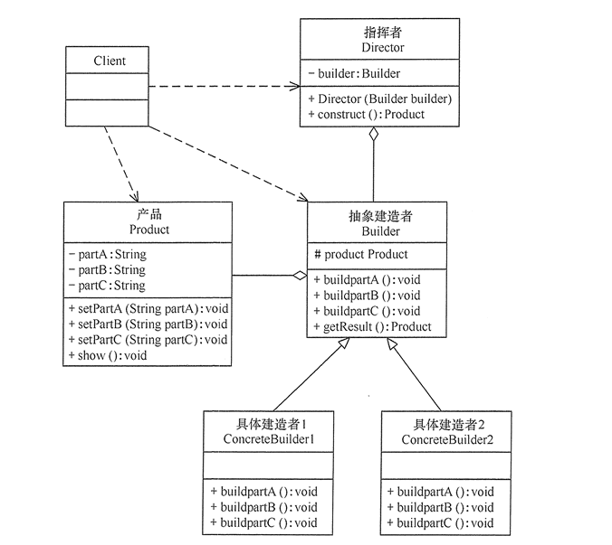

### 介绍

建造者（Builder）模式：指将一个复杂对象的构造与它的表示分离，使同样的构建过程可以创建不同的表示，属于**建造者模式**。它是将一个复杂的对象分解为多个简单的对象，然后一步一步构建而成。它将变与不变相分离，即产品的组成部分是不变的，但每一部分是可以灵活选择的。只需指定需要建造的类型就可以获得对象，建造过程细节不需要了解。

建造者模式适用于创建对象需要很多步骤，但是步骤的顺序不一定固定。

### 优点

1. 封装性好，构建和表示分离。
2. 扩展性好，各个具体的建造者相互独立，有利于系统解耦。
3. 客户端不必知道产品内部组成的细节，建造者可以对创建过程细化，而不对其它模块产生任何影响，便于控制细节风险。

### 缺点

1. 产品的组成部分必须相同，这限制了其使用范围。
2. 如果产品的内部变化复杂，内部发生变化，则建造者也要同步修改，后期维护成本较大。

>  建造者模式和工厂模式的关注点不同：建造者模式注重零部件的组装过程，而工厂方法模式更注重零部件的创建过程，两者可以结合使用。

### 结构

建造者（Builder）模式的主要角色如下。

1. 产品角色（Product）：它是包含多个组成部件的复杂对象，由具体建造者来创建其各个零部件。
2. 抽象建造者（Builder）：它是一个包含创建产品各个子部件的抽象方法的接口，通常还包含一个返回复杂产品的方法 getResult()。
3. 具体建造者(Concrete Builder）：实现 Builder 接口，完成复杂产品的各个部件的具体创建方法。
4. 指挥者（Director）：它调用建造者对象中的部件构造与装配方法完成复杂对象的创建，在指挥者中不涉及具体产品的信息。

### 应用场景

1. 相同的方法，不同的执行顺序，产生不同的结果。
2. 多个部件或零件，都可以装配到一个对象中，但产生的结果不同。
3. 产品类非常复杂，或者产品类中的调用顺序不同产生不同的作用。
4. 当初始化一个对象特别复杂，参数多，而且很多参数都具有默认值。

### 链式编程

通常采用链式编程的方式构造对象。

例如：

> StringBuilder.append();等等

链式编程，操作builder，连续引用。。

链式编程，操作builder，连续引用。。

StringBuilder.append();

