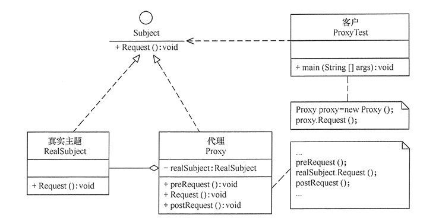

代理模式（Proxy Pattern）是指为其他对象提供一种代理，以控制对这个对象的访问。
代理对象在客户端和目标对象之间起到中介作用。

属于**结构型设计模式**

### 三种角色

1. 抽象主题角色（Subject）：抽象主题类的主要职责是声明真实主题与代理的共同接口方法，该类可以是接口也可以是抽象类。
2. 真实主题角色（Real Subject）：该类也被称为代理类，该类定义了代理所表示的真实对象，是负责执行系统真正的逻辑业务对象。
3. 代理主题角色（Proxy）：也被称为代理类，其内部持有Real Subject的引用，因此具备完全对Real Subject的代理权。客户端调用代理对象的方法，同时也调用被代理对象的方法，但是会在代理对象前后增加一些处理代码。

> 一般代理会被理解为代码增强，实际上就是在原代码逻辑前后增加一些代码逻辑，而使调用者无感知。
>
> 代理模式分为**静态代理和动态代理**。
>
> - 静态：由程序员创建代理类或特定工具自动生成源代码再对其编译，在程序运行前代理类的 .class 文件就已经存在了。
> - 动态：在程序运行时，运用反射机制动态创建而成。

**使用代理模式主要是：保护目标对象、增强目标对象。**

### 优点

- 代理模式在客户端与目标对象之间起到一个中介作用和保护目标对象的作用。
- 代理对象可以扩展目标对象的功能。
- 代理模式能将客户端与目标对象分离，在一定程度上降低了系统的耦合度，增加了程序的可扩展性。

### 缺点

* 代理模式会造成系统设计中类的数量增加。
* 在客户端和目标对象之间增加一个代理对象，会造成请求处理速度变慢。
* 增加了系统的复杂度。

[代理模式Demo]: https://github.com/crazy-xu/design-patterns/tree/main/proxy-pattern

动态代理模式，有点懵啊啊啊...

Jdk动态代理、*CGLIB*

