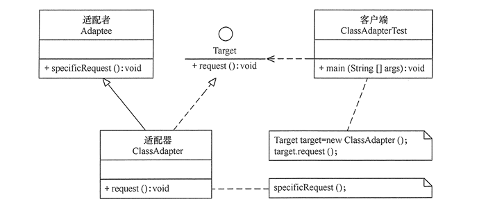
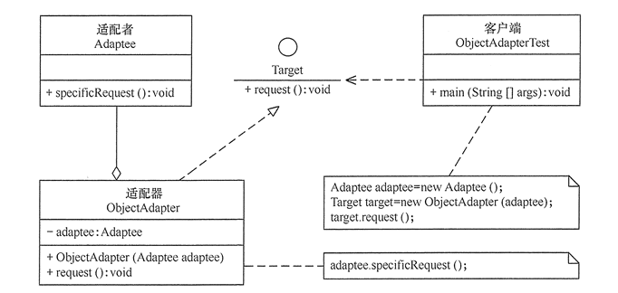

### 模式的定义与特点

适配器模式（Adapter Pattern）的定义如下：将一个类的接口转换成客户希望的另外一个接口，使得原本由于接口不兼容而不能一起工作的那些类能一起工作。适配器模式分为类结构型模式和对象结构型模式两种，前者类之间的耦合度比后者高，且要求程序员了解现有组件库中的相关组件的内部结构，所以应用相对较少些。可以理解为**电源适配器**。

#### 优点

- 客户端通过适配器可以透明地调用目标接口。
- 复用了现存的类，程序员不需要修改原有代码而重用现有的适配者类。
- 将目标类和适配者类解耦，解决了目标类和适配者类接口不一致的问题。
- 在很多业务场景中符合开闭原则。

#### 缺点

- 适配器编写过程需要结合业务场景全面考虑，可能会增加系统的复杂性。
- 增加代码阅读难度，降低代码可读性，过多使用适配器会使系统代码变得凌乱。

### 模式的结构与实现

适配器模式（Adapter）包含以下主要角色：

1. 目标（Target）接口：当前系统业务所期待的接口，它可以是抽象类或接口。
2. 适配者（Adaptee）类：它是被访问和适配的现存组件库中的组件接口。
3. 适配器（Adapter）类：它是一个转换器，通过继承或引用适配者的对象，把适配者接口转换成目标接口，让客户按目标接口的格式访问适配者。

**类适配器模式结构图如下：**

**对象适配器模式的结构图如下：**

### 模式的应用场景

1. 已经存在的类，它的方法和需求不匹配（方法结果相同或相似）的情况。
2. 适配器模式不是软件设计阶段考虑的设计模式，是随着软件维护，由于不同产品、不同厂家造成功能类似而接口不相同情况下的解决方案。

